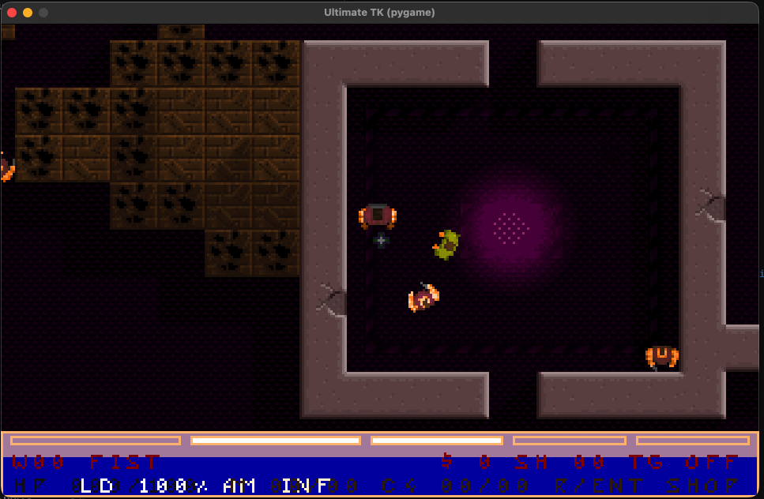

# Ultimate TK Python Port for AI-GYM

Python port of **Ultimate Tapan kaikki**, with Gymnasium/PPO tooling for AI training and visible model playback.

<video src="videos/Ultimate-TK-Python-AI-GYM.mp4" width="600" controls muted autoplay loop>
  Your browser does not support video.
</video>



## Origin, Credits, License

- This project is based on the original repository: `https://github.com/hkroger/ultimatetapankaikki`.
- All credits for the original game, assets, and core design belong to the original author(s) and contributors.
- This repository follows **GPL-3.0** licensing terms (see `LICENSE`).

## Scope

- This is not a 100% finished port, differs many ways, for example enemy AI behaviour.
- Playable runtime is available (headless, terminal, pygame).
- AI modules are implemented for Gymnasium environment usage, PPO training/evaluation, and saved-model pygame playback.
- For transparency, development phase plans and progress notes are kept in-repo under `docs/notes/` and `python_refactor.md`.

## AI Interface

This project exposes the game as a Gymnasium environment for reinforcement learning experiments.

- Environment wrapper lives under `src/ultimatetk/ai/`.
- `reset()` starts a fresh headless gameplay episode (default flow starts from level 1) and returns the first observation.
- `step(action)` applies AI controls to the same core gameplay simulation used by the normal game runtime.
- Supported control dimensions include movement, turning, strafing, shooting, and weapon selection.

### Observation Model

- The core spatial observation is a full `360°` scan split into `32` equal angular segments around the player.
- Each segment encodes nearest directional context (for example obstacle/enemy/projectile presence and distance-style signals).
- Segment features are combined with player/runtime telemetry into a compact PPO-friendly state vector.

### Rewards and Episode End

- Reward is shaped for learning-oriented behavior (survival, combat effectiveness, progression momentum).
- Reward shaping is still evolving and should be treated as an experiment surface, not a finalized benchmark setup.
- Episodes terminate on player death (`death`), successful run completion (`game_completed`), or configured step/time limits.

### Important Expectations

- This repository does **not** ship guaranteed "win-the-game" hyperparameters.
- There are no official one-click training presets that reliably solve the game out of the box.
- The AI stack is a sandbox for experimentation, iteration, and learning-oriented RL workflows.
- PPO tools (`tools/ppo_train.py`, `tools/ppo_eval.py`, `tools/ppo_play_pygame.py`) are provided as practical baselines.

## Requirements

- macOS/Linux/Windows with Conda installed (`miniconda` or `anaconda`)
- Python 3.12 (default target)

## Conda Environment Setup

### Option A: Recommended script setup

Creates or updates an environment and installs editable project dependencies (`dev`, `pygame`):

```bash
./scripts/setup_conda_env.sh
```

Custom environment name:

```bash
./scripts/setup_conda_env.sh my-env-name
```

Activate:

```bash
conda activate ultimatetk
```

### Option B: Manual minimal runtime setup

```bash
conda create -y -n ultimatetk python=3.12 pip
conda activate ultimatetk
python -m pip install --upgrade pip
python -m pip install -e "."
```

### Option C: Manual gameplay + pygame setup

```bash
conda create -y -n ultimatetk python=3.12 pip
conda activate ultimatetk
python -m pip install --upgrade pip
python -m pip install -e ".[dev,pygame]"
```

### Option D: Full AI training setup (Gymnasium + PPO + TensorBoard)

Start from Option C (or script setup), then install AI dependencies in the same env:

```bash
conda install -y -n ultimatetk -c conda-forge numpy gymnasium pytorch stable-baselines3 tensorboard "setuptools<81"
```

Optional editable extras (in active env):

```bash
python -m pip install -e ".[ai]"
python -m pip install -e ".[ai_train]"
```

## Run the Game

All commands assume repository root.

### Headless

```bash
PYTHONPATH=src python3 -m ultimatetk --max-seconds 2 --autostart-gameplay --status-print-interval 40
```

### Headless with scripted input replay

```bash
PYTHONPATH=src python3 -m ultimatetk --max-seconds 1.2 --autostart-gameplay --status-print-interval 20 --input-script "5:+MOVE_FORWARD;25:-MOVE_FORWARD;30:+TURN_LEFT;36:-TURN_LEFT"
```

### Terminal backend

```bash
PYTHONPATH=src python3 -m ultimatetk --platform terminal --autostart-gameplay --status-print-interval 20
```

### Pygame backend

```bash
PYTHONPATH=src python3 -m ultimatetk --platform pygame --autostart-gameplay --window-scale 3
```

Window scale examples:

- `--window-scale 2` -> `640x400`
- `--window-scale 3` -> `960x600`

## AI / Gymnasium / PPO

### Gym random-policy smoke test

```bash
python3 tools/gym_random_policy_smoke.py --episodes 1 --max-steps 300
```

### Train PPO

```bash
python3 tools/ppo_train.py
```

Uses default training settings from `tools/ppo_train.py`.

### PPO training parameters (`tools/ppo_train.py`)

Baseline command with explicit common defaults:

```bash
python3 tools/ppo_train.py \
  --total-timesteps 5000000 \
  --n-envs 1 \
  --device auto \
  --seed 123 \
  --n-steps 4096 \
  --batch-size 512 \
  --gamma 0.99 \
  --gae-lambda 0.95 \
  --clip-range 0.2 \
  --learning-rate-start 0.0003 \
  --learning-rate 0.00005 \
  --decay-ratio 0.8 \
  --ent-coef-start 0.05 \
  --ent-coef 0.01 \
  --max-episode-steps 6000 \
  --target-tick-rate 40 \
  --randomize-level-on-reset \
  --level-index-pool 0,1,2,3,4,5,6,7,8,9 \
  --checkpoint-freq 1000000 \
  --eval-freq 25000 \
  --eval-episodes 5
```

Example:

```bash
python3 tools/ppo_train.py --device auto --total-timesteps 30000000 --batch-size 512
```

Common flags and defaults:

- `--total-timesteps 5000000`
- `--n-envs 1`
- `--device auto`
- `--seed 123`
- `--n-steps 4096`
- `--batch-size 512`
- `--gamma 0.99`
- `--gae-lambda 0.95`
- `--clip-range 0.2`
- `--learning-rate-start 0.0003`
- `--learning-rate 0.00005`
- `--decay-ratio 0.8`
- `--ent-coef-start 0.05`
- `--ent-coef 0.01`
- `--max-episode-steps 6000`
- `--target-tick-rate 40`
- `--randomize-level-on-reset` (off by default)
- `--level-index-pool 0,1,2,3,4,5,6,7,8,9`
- `--checkpoint-freq 1000000`
- `--eval-freq 25000`
- `--eval-episodes 5`

Note:

- Run management flags: `--run-name`, `--runs-root`, `--resume-from`, `--disable-asset-manifest-check`, `--render-training-scenes`
- Scenario flag: `--weapon-mode`
- Level randomization flags: `--randomize-level-on-reset`, `--level-index-pool`

Level randomization behavior:

- With `--randomize-level-on-reset`, each training episode reset samples a start level from `--level-index-pool`.
- `--level-index-pool` accepts comma-separated non-negative level indices (duplicates are ignored).
- Evaluation callback env stays fixed at level index `0` for stable metric comparison across runs.

Weapon mode choices (`--weapon-mode` for both `ppo_train.py` and `ppo_eval.py`):

- `normal_mode` (default): keeps the normal weapon/ammo system, crates enabled, and standard level behavior
- `fist`
- `pistola`
- `shotgun`
- `uzi`
- `auto_rifle`
- `grenade_launcher`
- `auto_grenadier`
- `heavy_launcher`
- `auto_shotgun`
- `c4_activator`
- `flame_thrower`
- `mine_dropper`

Behavior in non-`normal_mode` weapon modes:

- Selected weapon is forced/equipped from episode start
- Player ammo is true infinite (no ammo consumption)
- Crates are disabled/removed

### Max-throughput training mode (uncapped training loop)

```bash
python3 tools/ppo_train.py --eval-freq 0 --checkpoint-freq 0
```

### Resume training from checkpoint

```bash
python3 tools/ppo_train.py --resume-from runs/ai/ppo/<run>/checkpoints/ppo_model_50000_steps.zip
```

### Evaluate a saved model

```bash
python3 tools/ppo_eval.py --model runs/ai/ppo/<run>/final_model.zip --episodes 5 --device auto
```

### Play a saved AI model in pygame (normal FPS cap)

```bash
python3 tools/ppo_play_pygame.py --model runs/ai/ppo/<run>/final_model.zip --target-fps 40 --window-scale 3 --device auto --weapon-mode normal_mode
```

Useful playback flags:

- `--max-seconds 30` limit playback wall time
- `--max-steps 2000` limit simulation steps
- `--weapon-mode auto_rifle` match playback scenario to training/eval mode
- `--allow-manual-input` mix keyboard input with AI actions for debugging
- `--stochastic` enable sampling mode (default playback/eval is deterministic)

### TensorBoard

Training writes logs under `runs/ai/ppo/<run>/tensorboard`.

```bash
tensorboard --logdir runs/ai/ppo/<run>/tensorboard --host 127.0.0.1 --port 6006
```

Open: `http://127.0.0.1:6006/`

### Device notes

- Apple Silicon: `--device auto` defaults to CPU for throughput; use `--device mps` explicitly if needed.
- CUDA hosts: `--device auto` prefers CUDA when available; use `--device cuda` to force.
- CPU fallback: `--device cpu`.

## Runtime Controls (Terminal + Pygame)

- Main menu: `W/S` or `A/D` select, `Space`/`Enter`/`Tab` confirm
- Movement/turn: `WASD` or arrow keys
- Strafe: `Q` / `E`
- Shoot: `Space`
- Next weapon: `Tab` (pygame also supports mouse wheel + `PageUp/PageDown`)
- Toggle shop: `R` or `Enter`
- Shop controls: `W/S` rows, `A/D` columns, `Space` buy, `Tab` sell
- Direct weapon slot: `` ` ``, `1..0`, `-` (pygame also supports numpad `0..9` and `F1..F12`)
- Quit: `Esc`

## Verification

Default release verification:

```bash
python3 tools/release_verification.py
```

Strict legacy parity against archived root:

```bash
python3 tools/release_verification.py --legacy-compare-root /path/to/original/legacy-root
```

## Project Paths

- Runtime assets: `game_data/`
- Runtime outputs and artifacts: `runs/`
- Phase notes: `docs/notes/`
- Refactor roadmap/progress log: `python_refactor.md`

## Utility Commands

Regenerate asset manifest and gap report:

```bash
python3 tools/asset_manifest_report.py
```

Copy archived legacy assets into `game_data/`:

```bash
python3 tools/migrate_legacy_data.py --legacy-root /path/to/original/legacy-root
```

Probe format loaders:

```bash
python3 tools/format_probe.py
```

Render probe screenshot:

```bash
python3 tools/render_probe.py --output runs/screenshots/phase3_render_probe.ppm
```

## AUTHOR

Timo Heimonen <timo.heimonen@proton.me>
